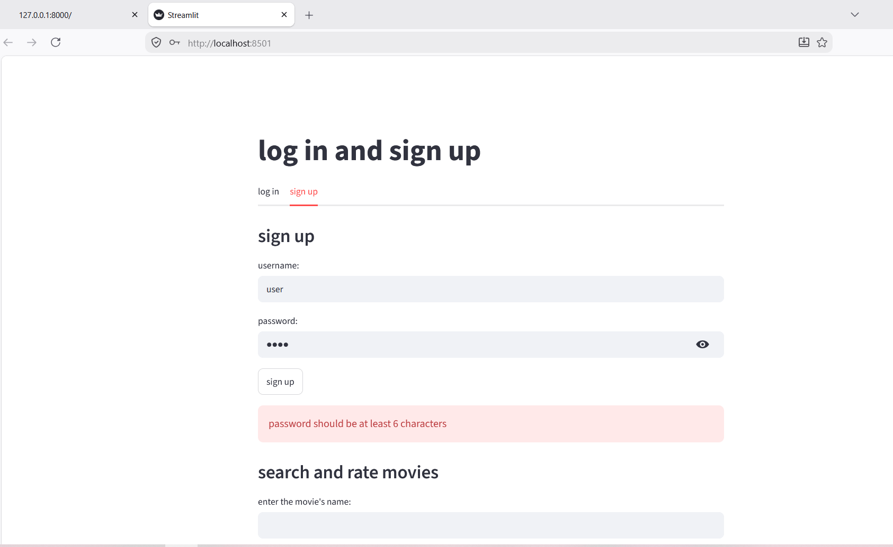
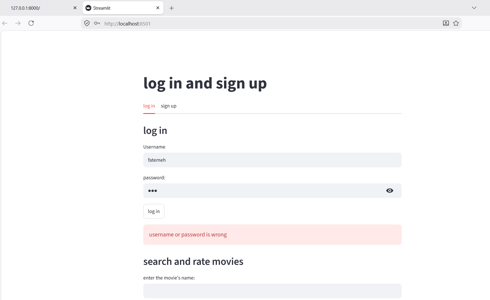
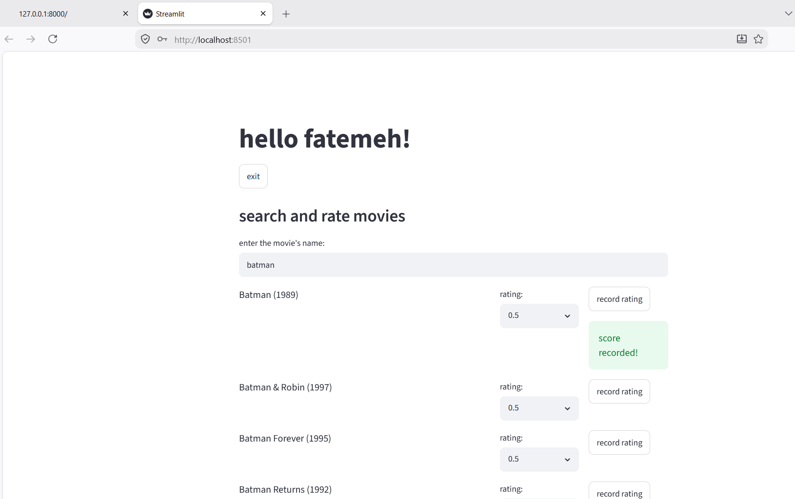
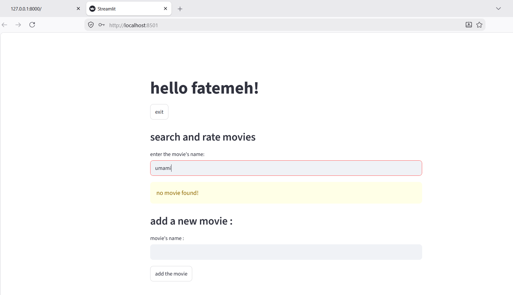
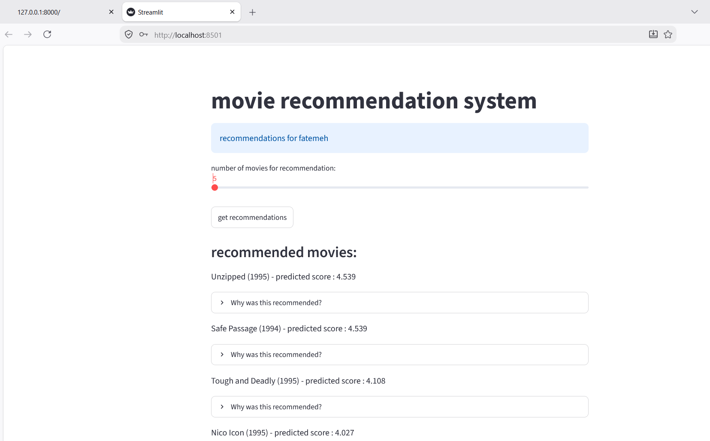
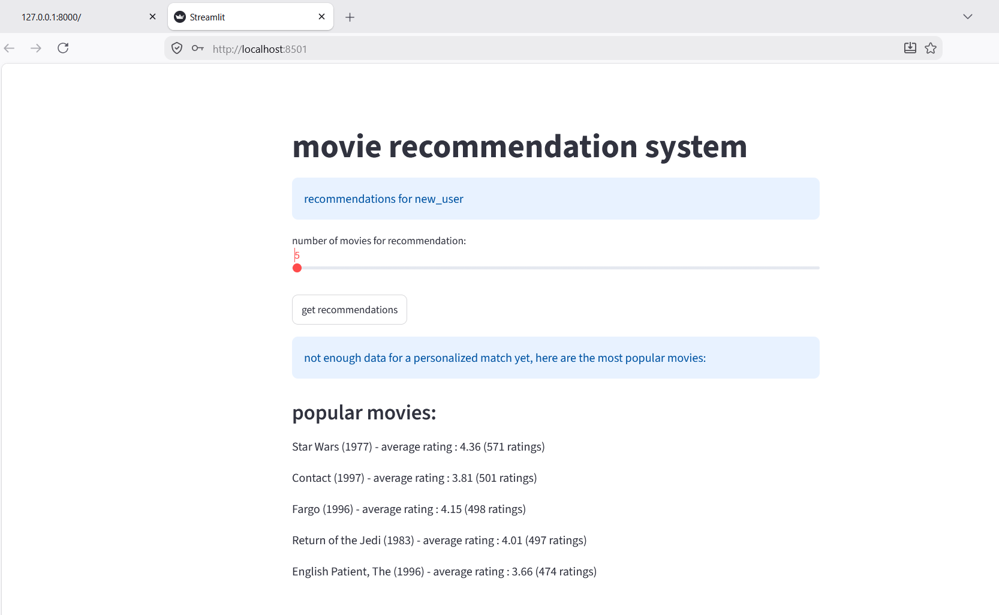
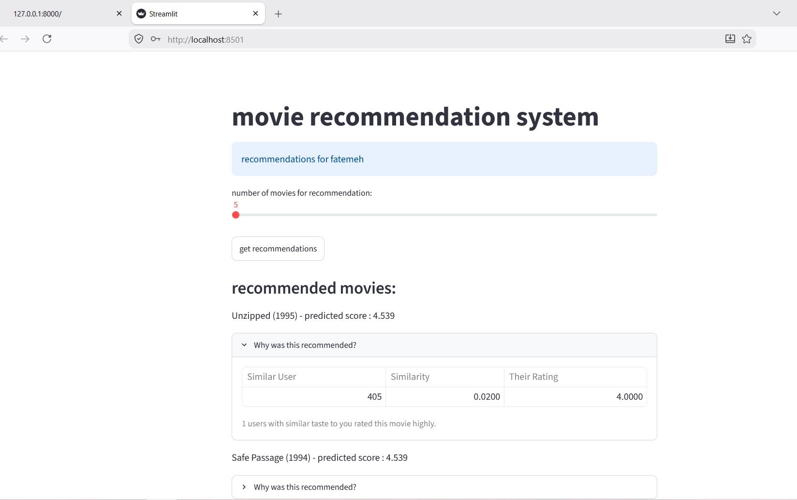

# Movie Recommendation System

A full-stack movie recommendation engine built with **User-Based Collaborative Filtering**, served through a **FastAPI** REST backend, a **Streamlit** frontend, and a **MySQL** database — fully containerized with **Docker**.

---

## Overview

This project implements a movie recommendation system that suggests films to users based on their rating history and the rating patterns of similar users. The core algorithm is **User-Based Collaborative Filtering (CF)** using cosine similarity, enhanced with **mean-centered normalization** to correct for individual rating bias (some users rate generously, others harshly).

For new users with no rating history — the classic **cold-start problem** — the system falls back to a **popularity-based recommendation** strategy, ensuring every user gets a meaningful response.

The system started as a single-file Streamlit script and evolved into a production-style, three-tier architecture with a dedicated REST API, JWT-based authentication, and full Docker containerization.

---

## Features

- 🔐 **User authentication** — registration and login with JWT tokens and bcrypt password hashing
- 🔍 **Movie search** — search the catalog and add new movies on the fly
- ⭐ **Rating system** — rate movies (0.5–5.0), with automatic upsert (insert or update)
- 🎯 **Personalized recommendations** — top-N movie suggestions based on collaborative filtering
- 🧊 **Cold-start handling** — popularity-based fallback for new users or sparse data
- 🧠 **Explainable recommendations** — see *why* a movie was recommended (which similar users rated it and how)
- 📊 **Model evaluation** — train/test split evaluation comparing raw CF, mean-centered CF, and a baseline model
- 🐳 **Fully containerized** — one command to spin up the entire stack

---

## System Architecture

The system follows a three-layer architecture:

```
┌─────────────────────┐
│   Streamlit UI       │   ← Presentation layer (HTTP client only)
│   (Frontend)          │
└──────────┬───────────┘
           │ REST (HTTP/JSON)
┌──────────▼───────────┐
│   FastAPI Backend     │   ← Service layer: routers, auth, validation
│  (auth / movies /      │
│   ratings / recs)      │
└──────────┬───────────┘
           │
┌──────────▼───────────┐
│  Business Logic        │   ← AuthManager, RecommenderSystem
└──────────┬───────────┘
           │
┌──────────▼───────────┐
│      MySQL             │   ← Data layer (users, movies, ratings)
└─────────────────────┘
```

All three services (frontend, backend, database) run as separate Docker containers on a shared internal network, communicating via Docker service names rather than hardcoded IPs.

The Streamlit frontend contains **no business logic** — it only talks to the FastAPI backend over HTTP through a shared `_api_request()` wrapper, which keeps the UI fully decoupled from the recommendation logic and makes it easy to plug in other clients (e.g., a mobile app) in the future.

---

## Tech Stack

| Layer | Technology | Role |
|---|---|---|
| **Frontend** | Streamlit, requests | Login/signup forms, search, rating, recommendation display |
| **API / Service** | FastAPI, Pydantic, python-jose, passlib/bcrypt | Routing, validation, JWT authentication, password hashing |
| **Business Logic** | pandas, scikit-learn, NumPy | User-item matrix, cosine similarity, rating prediction |
| **Data Layer** | MySQL, SQLAlchemy, mysql-connector (connection pool) | Persistent storage for users, movies, ratings |
| **Deployment** | Docker, docker-compose | Containerization of all three services |

---

## Dataset

This project uses the **[MovieLens 100K](https://grouplens.org/datasets/movielens/100k/)** dataset from GroupLens Research (University of Minnesota):

- 100,000 ratings (scale 0.5–5.0)
- 943 users
- 1,682 movies

MovieLens 100K was chosen for its manageable size, relatively good density, and status as a standard benchmark in recommender systems research.

---

## Recommendation Algorithm

### User-Based Collaborative Filtering

Each user is represented as a vector across all movies (unrated movies = 0). Similarity between users is computed with **cosine similarity**:

```
cosine_similarity(u, v) = (u · v) / (‖u‖ × ‖v‖)
```

The raw prediction for user `u` on item `i` is a similarity-weighted average of ratings from the top-k most similar users:

```
pred(u, i) = Σ [sim(u, v) × r(v, i)] / Σ |sim(u, v)|,  for v in N(u)
```

### Mean-Centering (key improvement)

Users differ systematically in how they rate — some are harsh, some are generous. Subtracting each user's average rating before computing predictions, then adding the target user's average back, removes this bias:

```
pred(u, i) = mean(u) + Σ [sim(u, v) × (r(v, i) − mean(v))] / Σ |sim(u, v)|,  for v in N(u)
```

> Note: the denominator uses the **absolute value** of similarity, since negative similarities become meaningful once ratings are mean-centered (they represent "opposite taste"), and must still contribute to the weighting.

This single change delivered the largest accuracy improvement in the project — roughly a **7% RMSE reduction** over the raw CF model — and is enabled by default.

### Cold-Start Fallback

For users with no ratings, or when no similar users can be found, the system falls back to a **popularity-based ranking**:

1. Group ratings by movie
2. Sort by number of ratings (descending), then by average rating (descending)
3. Return the top-N movies

Sorting by rating *count* first (not just average) avoids small-sample bias, where a movie with one 5-star rating would otherwise outrank a movie with hundreds of consistently high ratings.

---

## Evaluation

Model accuracy is measured with an independent script (`evaluation.py`) that:

1. Splits ratings into train/test sets (80/20)
2. Builds the similarity matrix using **only training data** (to avoid data leakage)
3. Compares three models: raw CF, mean-centered CF, and a simple baseline (per-movie average rating)

| Model | RMSE (approx.) |
|---|---|
| Raw Collaborative Filtering | ≈ 1.01 |
| **Mean-Centered CF (default)** | **≈ 0.95** |
| Baseline (movie average) | ≈ 1.02 |

Mean-centering alone — with minimal added complexity — brings the model within the expected benchmark range reported in prior research on MovieLens 100K.

---

## API Documentation

The backend exposes a REST API under the following routers:

| Method | Endpoint | Description |
|---|---|---|
| `POST` | `/auth/register` | Register a new user, returns a JWT |
| `POST` | `/auth/login` | Log in, returns a JWT |
| `GET` | `/movies/search?q=` | Search movies by title |
| `POST` | `/movies` | Add a new movie |
| `POST` | `/ratings` | Add or update a rating (requires auth) |
| `GET` | `/ratings/count/{user_id}` | Get a user's rating count |
| `GET` | `/recommendations/{user_id}?top_n=` | Get top-N recommendations (personalized or popular fallback) |
| `GET` | `/recommendations/{user_id}/{movie_id}/explain?k=` | Explain why a movie was recommended |
| `GET` | `/health` | Health check |

Once the backend is running, interactive API docs (Swagger UI) are available at:

```
http://localhost:8000/docs
```

---

## Project Structure

```
.
├── main.py                 # FastAPI app entrypoint, routers, error handlers
├── dependencies.py         # Dependency injection (DB, auth, recommender)
├── security.py             # JWT creation/decoding
├── schemas.py               # Pydantic request/response models
├── database.py              # MySQL connection pool + queries
├── auth.py                  # User registration & login logic
├── recommender.py          # Collaborative filtering engine
├── evaluation.py            # RMSE/MAE evaluation script (train/test split)
├── api/
│   ├── auth.py               # /auth router
│   ├── movies.py             # /movies router
│   ├── ratings.py            # /ratings router
│   └── recommendations.py    # /recommendations router
├── app.py                    # Streamlit frontend
├── requirements.txt
├── docker-compose.yml
├── Dockerfile.backend
├── Dockerfile.frontend
└── backup.sql                # Initial MySQL data dump
```

---

## Installation

### Prerequisites

- Python 3.10+
- MySQL Server
- pip

### Steps

1. Clone the repository:
   ```bash
   git clone https://github.com/<your-username>/<repo-name>.git
   cd <repo-name>
   ```

2. Create a virtual environment and install dependencies:
   ```bash
   python -m venv venv
   source venv/bin/activate      # On Windows: venv\Scripts\activate
   pip install -r requirements.txt
   ```

3. Set up your `.env` file:
   ```env
   DB_USER=root
   DB_PASSWORD=your_password
   DB_HOST=localhost
   DB_NAME=movie_recommender
   JWT_SECRET_KEY=your_secret_key
   ```

4. Import the initial database dump:
   ```bash
   mysql -u root -p movie_recommender < backup.sql
   ```

5. Run the backend:
   ```bash
   uvicorn main:app --reload
   ```

6. Run the frontend (in a separate terminal):
   ```bash
   streamlit run app.py
   ```

---

## Running with Docker

The easiest way to run the full stack is with Docker Compose:

```bash
docker-compose up --build
```

This spins up three containers:

| Service | Description | Port |
|---|---|---|
| `mysql_db` | MySQL database, pre-loaded with `backup.sql` | 3306 |
| `backend` | FastAPI REST API | 8000 |
| `frontend` | Streamlit UI | 8501 |

Once running, access the app at:

```
http://localhost:8501
```

> **Note:** Inside Docker, set `DB_HOST=mysql_db` (the Docker service name) rather than `localhost`.

---

## Screenshots

### Authentication

Registration and login are validated on both the client and the API side (Pydantic validation with custom error messages).

| Sign Up (validation error) | Login (invalid credentials) |
|---|---|
|  |  |

### Search & Rate Movies

Logged-in users can search the catalog and submit ratings, which are immediately persisted and trigger a refresh of the similarity matrix.



If a searched title isn't found, the user can add it directly to the database.



### Personalized Recommendations

Once a user has rated enough movies, the mean-centered collaborative filtering model generates personalized top-N recommendations.



### Cold-Start Fallback

For a brand-new user with no ratings, the system automatically falls back to popularity-based recommendations instead of failing.



### Explainable Recommendations

Each recommendation can be expanded to show *why* it was suggested — the similar users, their similarity score, and the rating they gave.



---

## Future Improvements

- [ ] Re-tune the optimal `k` (neighborhood size) specifically for the mean-centered model
- [ ] Expose `min_ratings` for the popularity fallback as a user-adjustable slider
- [ ] Extend to Item-Based Collaborative Filtering or Matrix Factorization for comparison
- [ ] Deploy publicly once cloud hosting constraints are resolved

---

## Author

Built as an academic capstone project, supervised by Dr. Boushehrian.
